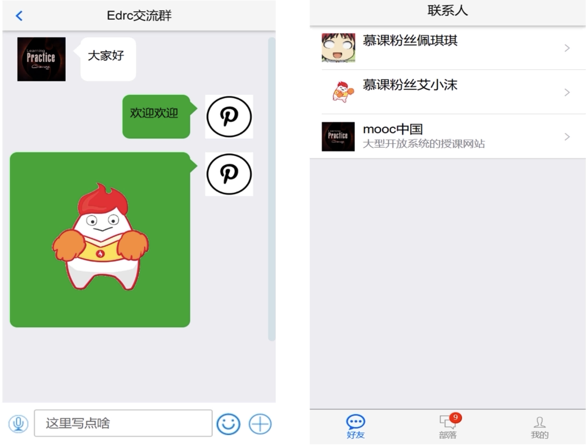
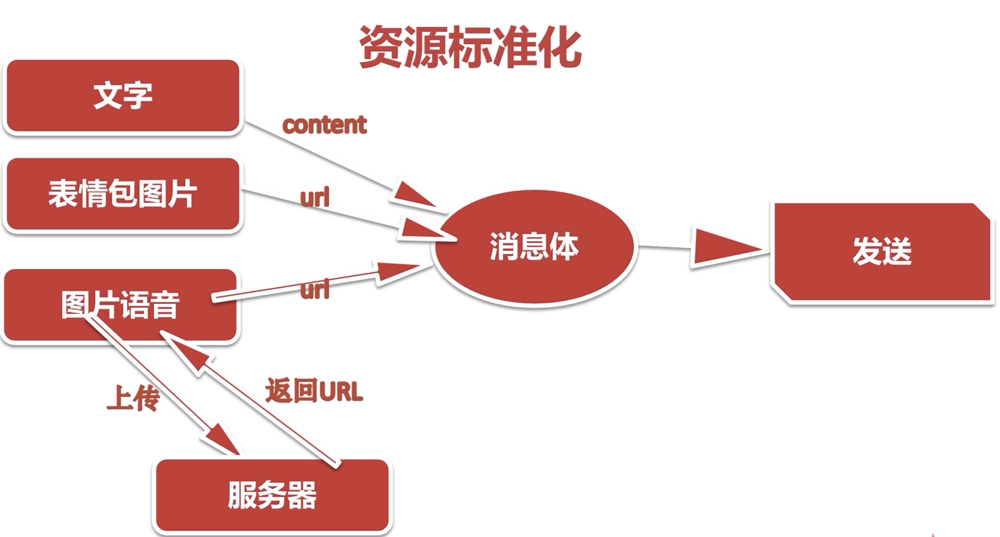
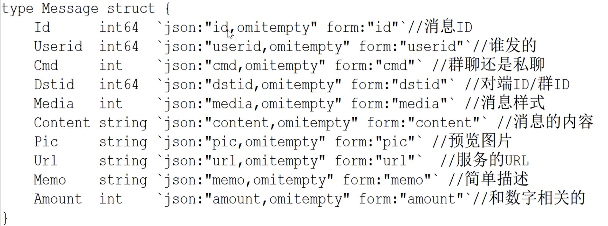
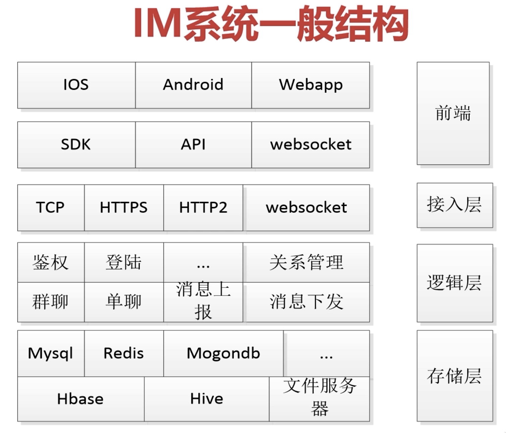
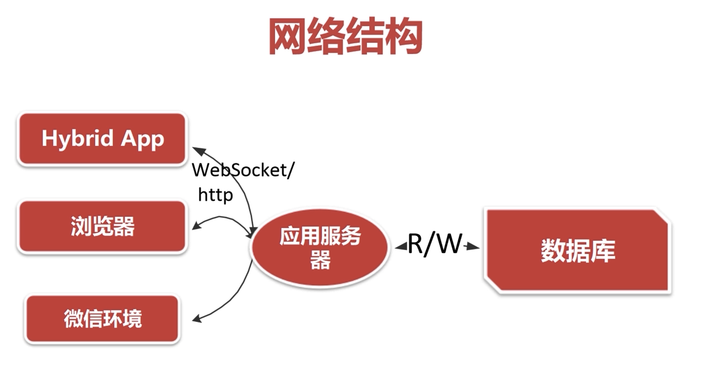

# instantMessagingWithGo
 Go语言实现的IM

已搁置,教程有点拉

IM是社交/电商/办公标配，要求我们会做IM.

IM产品用户对性能和体验要求较高

具备迅速响应突发事件的能力

IM是实时通讯的典型技术代表

## 要实现的功能

* IM发送文字,表情包 图片

* IM发送语音,视频

* 实现红包,表单等

## 如何实现并发及性能调优

* websocket的使用
* 并发优化工作
* 分布式部署

## 分布式部署

* 分布式部署方案
* 分布式部署实战

## 技术栈

### 前端

* h5: ajax/获取音频/websocket发送消息
* vue制作单页app
* mui组件

### 后端

* websocket组件
* channel/goroutine 并发
* templete技术(模板渲染技术)

### 系统架构

* 反向代理
* 消息总线MQ/Redis
* 协议Udp/http2

## 需求分析

* 发送/接收
* 实现群聊
* 高并发 = 单机最好+分布式+弹性扩容

### 功能界面

### 资源标准化编码

* 资源信息采集并标准化 转成content/uri
* 资源编码,将内容拼接成一个消息体类型(json/xml)

### 消息体的可扩展性

* 兼容基础媒介 如图片 文字 语音信息
* 承载扩张能力,后续的业务扩张不能影响现有的业务
* 红包/打卡/签到等本质是消息内容

消息体的初步定义

### 接收需求分析

* 接收到消息体并进行解析展示
* 区分显示不同的形式
* 区别自己发送和他人发送

### 群聊需求

* 基本功能无区别
* 1条消息所有参与群聊的人员都需要接收到图片(流量要求高)
  * 使用缩略图,提供原图
  * 提高资源服务并发能力,使用云服务(alioss)
  * 压缩消息体,不发送文件内容 而是发送文件路径

### 高并发

* 单机并发性能最优
* 分布式部署
* 突发事件的弹性扩容

## IM系统架构

http协议:提供api服务? websocket协议提供长连接推送服务

## WebSocket协议

WebSocket 可以实现更高效、更实时的通信，因此被广泛应用于实时聊天、在线游戏等场景,主要特性如下:

1. 双向通讯: 传统的HTTP请求是单向的,即客户端向服务器发送请求,服务器返回响应.而WebSocket支持双向通讯,客户端和服务器之间可以同时发送消息.
2. 持久连接:传统的HTTP请求和响应之后都会关闭连接,下一次请求需要重新建立连接.而 WebSocket 协议建立连接后会保持持久连接，不会关闭，从而避免了频繁建立和关闭连接的开销。
3. 小的包头:传统的HTTP请求包含较大的头部信息,占用了较多的带宽,而WebSocket协议的包头较小,可以更高效地传输数据.
4. 低延迟:由于 WebSocket 协议支持双向通信和持久连接，可以更快地发送和接收消息，从而降低了通信延迟，提高了实时性。

在本项目中使用到了Go的一个开源库`github.com/gorilla/websocket`,它提供了一组API,开发者可以在服务器端创建WebSocket连接,同时也可以在客户端与服务器之间建立WebSocket连接,该库还提供了一些实用的工具函数,例如Json消息的编解码,消息的压缩等等.
